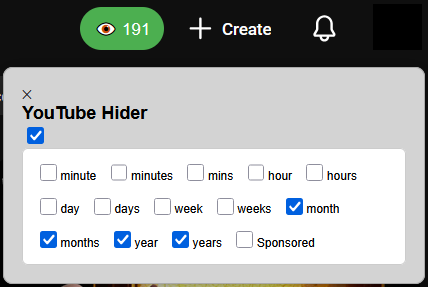
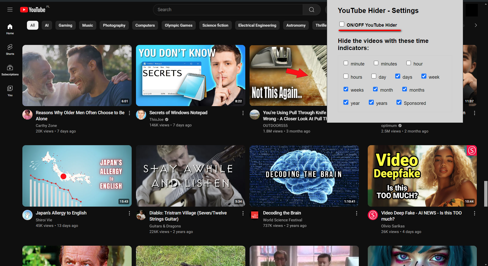
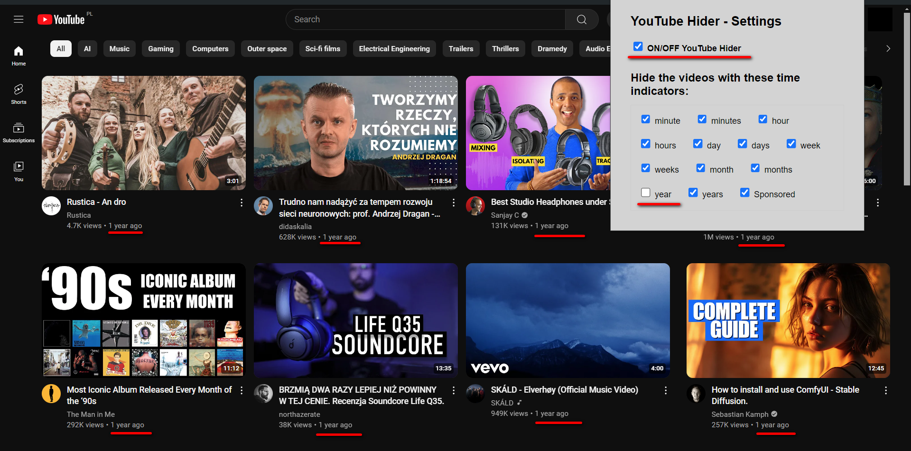
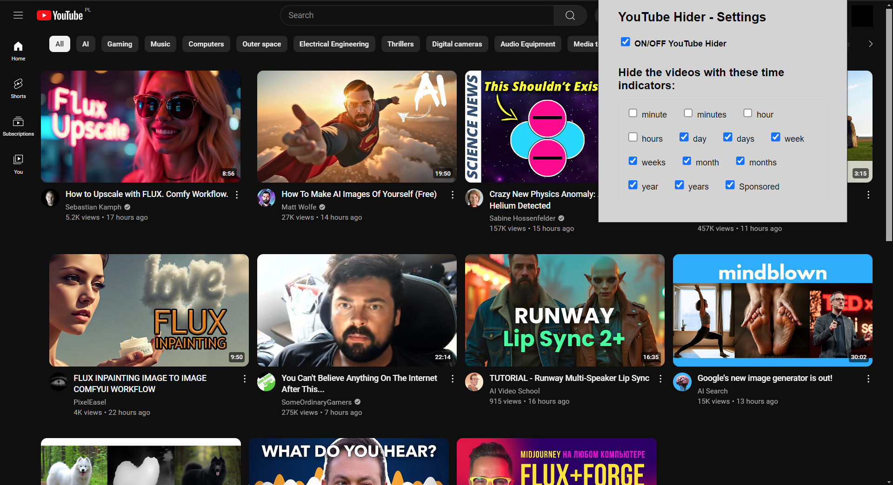
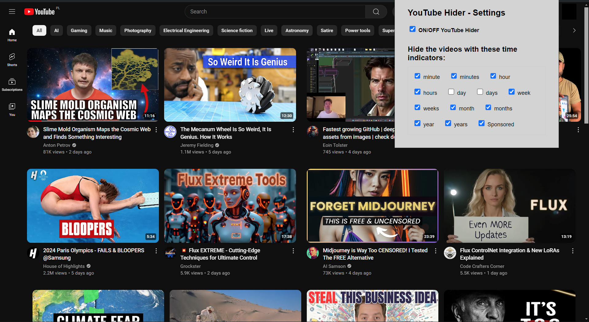
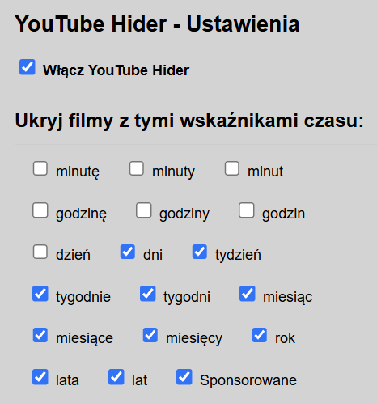

# youtube hider - Chrome extension

10.04.2026 add Firefox Tampermonkey 1.5 EN and PL version (settings-click green button)



08.04.2026 v1.5 fixed

04.04.2026 v1.4 fixed

03.04.2026 Youtube change page AGAIN-extension stop working...

29.08.2025 Youtube change selectors AGAIN-extension stop working.-fixed in version 1.3

Filtering in Youtube page by time.

## Turn extension, select filters, wait for the page to scroll and filter/sorting the results.
<br>
with sorting (new--->old)
<br>
<br>
<br>
EN
<br>


<br>
<br>
<br>
v1


<br>
<br>
<br>
v1


<br>
<br>
<br>
v1


<br>
<br>
<br>
v1


<br>
<br>
<br>
## You can customize the extension to your language by changing the words in the file: background.js and popup.js
```
function setDefaultSettings() {
  const defaultKeywords = [
    "minute", "minutes", "hour", "hours", "day", "days", "week", "weeks", "month", "months", "year", "years", "Sponsored"
  ];
```  
***

PL

v1




