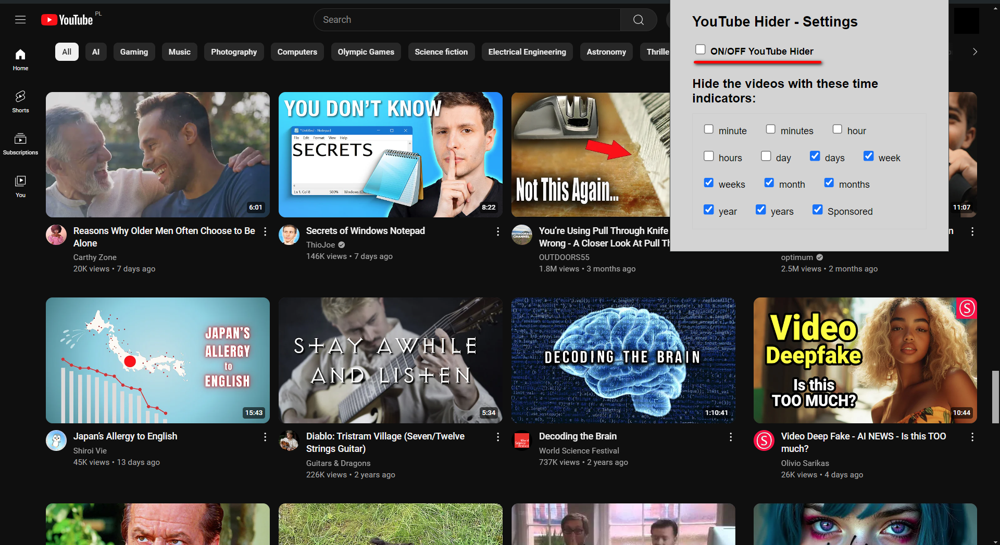
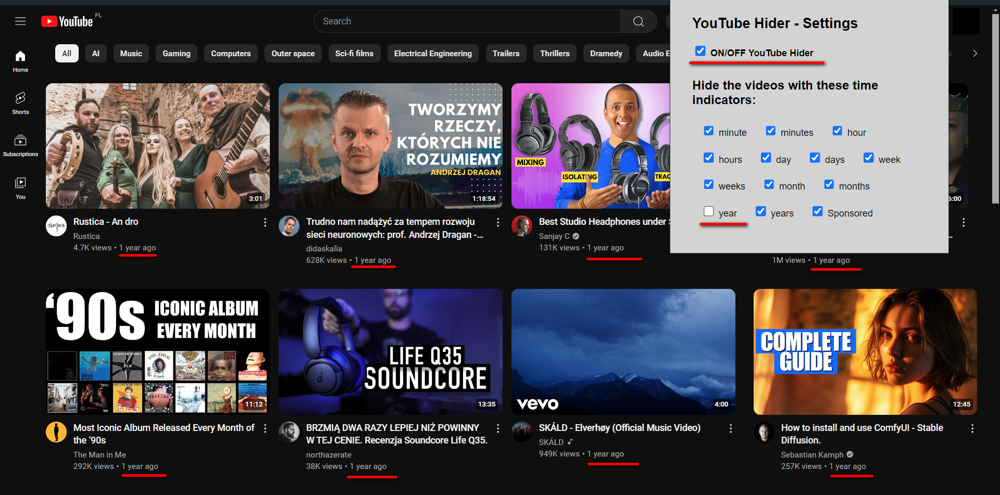
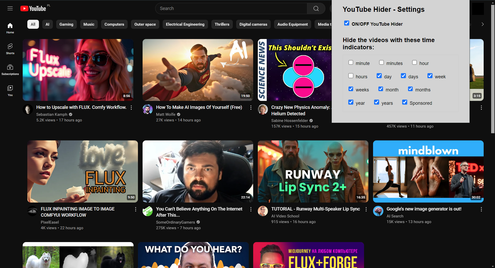
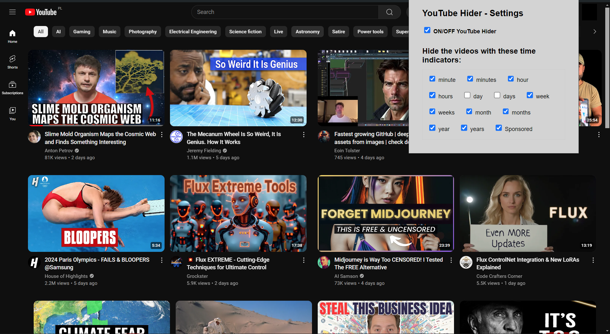
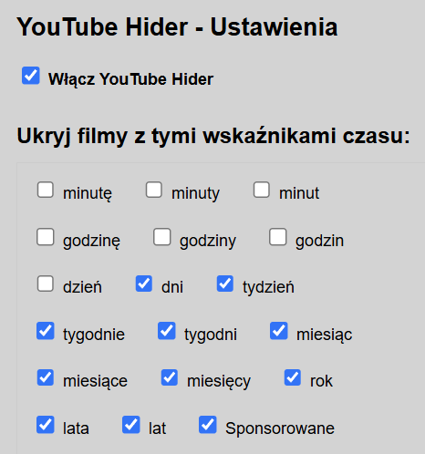

# Youtube Hider - Chrome extension&Firefox (Tampermonkey script)
08.10.2026 ADD Blocking Non PL/ENG titles+overlay switch


06.10.2026 1.9 version


29.05.2026 1.6 version-fix filtering & sorting

April 10, 2026: Added the Tampermonkey extension for Firefox (English and Polish versions) (Settings—click the green button)


08.04.2026 v1.5 fixed

04.04.2026 v1.4 fixed

03.04.2026 Youtube change page AGAIN-extension stop working...

29.08.2025 Youtube change selectors AGAIN-extension stop working.-fixed in version 1.3

Filtering in Youtube page by time.

## Turn extension, select filters, wait for the page to scroll and filter/sorting the results.
<br>
with sorting (new--->old)
<br>
<br>
<br>
EN
<br>


<br>
<br>
<br>
v1


<br>
<br>
<br>
v1


<br>
<br>
<br>
v1


<br>
<br>
<br>
v1


<br>
<br>
<br>
## You can customize the extension to your language by changing the words in the file: background.js and popup.js
```
function setDefaultSettings() {
  const defaultKeywords = [
    "minute", "minutes", "hour", "hours", "day", "days", "week", "weeks", "month", "months", "year", "years", "Sponsored"
  ];
```  
***

PL

10 kwietnia 2026 r.: Dodano rozszerzenie Tampermonkey 1.5 dla przeglądarki Firefox (wersje angielska i polska) (ustawienia-kliknij zielony przycisk)

v1




