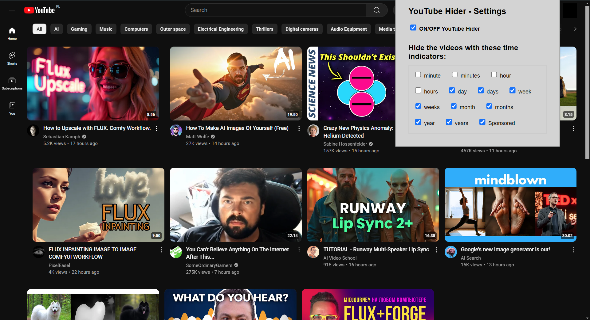
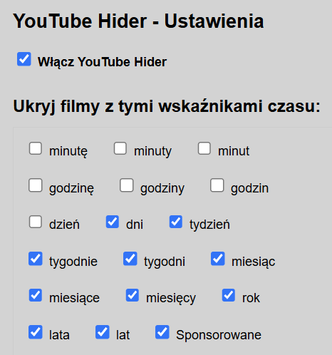

# youtube hider - Chrome extension

Filtering in Youtube page by time.
<br>
v2 with sorting (new--->old)
<br>
<br>
<br>
EN
<br>

<br>
<br>
<br>

<br>
<br>
<br>

<br>
<br>
<br>

<br>
<br>
<br>

<br>
<br>
<br>
## You can customize the extension to your language by changing the words in the file: background.js and popup.js
```
function setDefaultSettings() {
  const defaultKeywords = [
    "minute", "minutes", "hour", "hours", "day", "days", "week", "weeks", "month", "months", "year", "years", "Sponsored"
  ];
```  
***

PL



